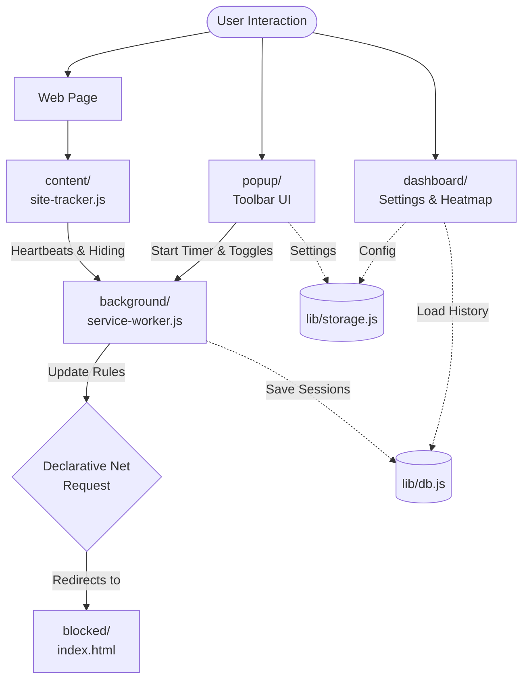

# Contributing to Flow

Thank you for your interest in contributing to Flow! Whether you are fixing a bug, suggesting a new feature, refining translations, or optimizing performance, your contributions are welcome.

---

## Code of Conduct

Flow is an independent, open-source project. Please:
* Be respectful and constructive in issues, discussions, and pull requests.
* Focus on actionable feedback and clear communication.
* Remember that contributors are volunteering their time.

---

## How to Contribute

### 1. Reporting Bugs & Feature Requests
* Search existing [GitHub Issues](https://github.com/vishwa-vsr/Flow/issues) to verify the bug or feature has not already been logged.
* If opening a new bug report, include:
  * Browser name and version (e.g., Chrome 124, Firefox 125).
  * Operating system (Windows, macOS, Linux).
  * Clear step-by-step reproduction steps.
  * Expected vs. actual behavior (and console errors if available).

### 2. Improving Translations
Flow supports 11 locales located in `src/_locales/`. If you are a native speaker and notice awkward phrasing:
* Read our [Translation Guide](./TRANSLATING.md) for formatting rules and placeholder constraints.
* Either submit a Pull Request editing the corresponding `messages.json` file, or post your feedback in the [Translation Discussions Thread](https://github.com/vishwa-vsr/Flow/discussions/4).

### 3. Submitting Code Changes

#### Local Development Setup
1. Fork and clone the repository:
   ```bash
   git clone https://github.com/<your-username>/Flow.git
   cd Flow
   ```
2. Install dependencies:
   ```bash
   npm install
   ```
3. Load the extension in your browser:
   * **Chromium (Chrome / Edge / Brave):** Go to `chrome://extensions`, enable **Developer mode**, click **Load unpacked**, and select the **`src/`** folder.
   * **Firefox:** Go to `about:debugging#/runtime/this-firefox`, click **Load Temporary Add-on...**, and select `src/manifest.json`.

---

## 🏗️ Architecture Overview

Flow is built on **Manifest V3**. The data flow and component boundaries are structured as follows:



* **`src/lib/constants.js`** — Shared constants, default categories, and CSS tweak maps.
* **`src/lib/db.js`** — IndexedDB wrapper for long-term daily analytics (`FocusFlowDB`).
* **`src/lib/storage.js`** — `chrome.storage` helpers (local, sync, session) with in-memory cache.
* **`src/lib/icons.js`** — FlowIcons SVG icon engine (auto-renders `data-icon` attributes).
* **`src/lib/i18n.js`** — Localization helper and dynamic language switching.
* **`src/lib/chart.min.js`** — Bundled Chart.js 4.5 (local, zero CDN).

---

## 📐 Development Guidelines

### 1. Conventional Commits
We follow the [Conventional Commits](https://www.conventionalcommits.org/) standard. This helps auto-generate changelogs and keeps the history clean. Please prefix your commits:
* `feat:` for new features (e.g., `feat: add custom timer preset`)
* `fix:` for bug fixes (e.g., `fix: reset cooldown overlay on click`)
* `docs:` for documentation changes
* `style:` for formatting, missing semi-colons, etc.
* `refactor:` for code changes that neither fix a bug nor add a feature

### 2. General Rules
1. **Local-First & Zero Telemetry:** Never add external network calls, tracking scripts, or cloud dependencies. All state must remain on the client.
2. **Minimal Dependencies:** Standard Web APIs are preferred over third-party npm packages.
3. **No Full-File Auto-Formatting:** Avoid running global "Format Document" (Prettier / VS Code formatters) across existing files. Only format the specific lines you changed. Large reformatting diffs make code review difficult.
4. **Visual Context for UI Changes:** If your PR changes the popup, dashboard, or blocked page, **attach a screenshot or GIF** of the UI in action.
5. **Use the Central Icon Engine (`FlowIcons`):** Do not write inline `<svg>` elements. Use `<span data-icon="iconName"></span>` in HTML or `FlowIcons.get("iconName")` in JS via `src/lib/icons.js`.
6. **Locale Validation:** Any added translation key must exist in `src/_locales/en/messages.json` and follow Chrome's `$placeholder$` schema requirements. Running `npm run build` will verify this automatically.

---

## 🛠️ Build Commands & Release Process

All build tooling is defined in `package.json` and runs via Node.js:

| Command | Description |
| :--- | :--- |
| `npm run build` | Validates i18n parity, minifies JavaScript/CSS with `esbuild`, adjusts Firefox manifests, and outputs to `dist/chrome/`, `dist/edge/`, and `dist/firefox/`. |
| `npm run zip` | Runs the build and generates store-ready archives in `release/`. |
| `npm run bundle-chart` | Rebundles `Chart.js` into `src/lib/chart.min.js`. |

> **Skip Prompt Flag:** To run the build without interactive CLI prompts, use `npm run build -- --yes`.

### Release Process (For Maintainers)
Flow follows Semantic Versioning (SemVer). To cut a new release:
1. Update the version number in `src/manifest.json`.
2. Document the changes in `CHANGELOG.md` under a new version heading.
3. Commit with `chore: release vX.Y.Z`.
4. Run `npm run zip` to generate the `.zip` packages for the Chrome Web Store, Edge Add-ons, and Mozilla AMO.
5. Upload the zips and create a GitHub Release with the source code.

---

## 🌐 Supported Browsers Matrix

Please test your changes on at least one browser engine before submitting a pull request:

| Engine | Target Browsers | Loading Method |
| :--- | :--- | :--- |
| **Chromium** | Google Chrome, Microsoft Edge, Brave, Opera, Vivaldi | `chrome://extensions` → Load unpacked → `src/` |
| **Gecko** | Mozilla Firefox, Zen Browser, Floorp | `about:debugging#/runtime/this-firefox` → Load Temporary Add-on → `src/manifest.json` |

---

## 📋 Pull Request Checklist

Before submitting a Pull Request, please ensure:
- [ ] **Tested Locally:** Tested in Developer Mode on at least one Chromium or Firefox browser.
- [ ] **Build & Linter Passes:** `npm run build -- --yes` compiles with 0 errors (all i18n checks pass).
- [ ] **Commit Messages:** Follow the `feat:`, `fix:`, `docs:` convention.
- [ ] **No Full-File Reformatting:** Git diff only includes the relevant logic/style changes.
- [ ] **Visual Proof Attached:** Screenshots or GIFs included in the PR description for any UI modifications.
- [ ] **Zero Telemetry / Local-First:** Verified that no external server requests or tracking mechanisms were introduced.
